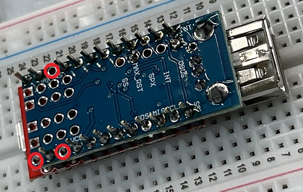

# X68000Z版グラディウスをXboxコントローラーでSteam版グラディウス風の操作で遊ぶ

## 概要
Pro MicroとUSB Host Shieldで変換回路を作り、XboxコントローラをX68000Zに繋いでSteam版グラディウス風の操作方法で遊べるようにする手順のご紹介です。  
下記のコントローラ設定でX68000Z版グラディウスが遊べるようになります。  
  

## 準備
Pro MicroとUSB Host Shieldを組み合わせた回路を作るにあたり、  
ht-deko氏の下記ページを参考にしました。  
[https://ht-deko.com/arduino/shield_usbhost_mini.html#08](https://ht-deko.com/arduino/shield_usbhost_mini.html#08)  

今回、使用した部品は下記になります。  
### 使用部品
* [Pro Micro 3.3V/8MHz【DEV-12587】](https://www.marutsu.co.jp/pc/i/1558352/)(マルツオンライン)  
* [24ピン基板用ピンヘッダー[24ピン×1列]【2130S1*24GSE】](https://www.marutsu.co.jp/pc/i/127656/)(マルツオンライン)  
* [GAOHOU ミニUSBホストシールド2.0 ADK SLR開発ツール互換SPIインターフェイス](https://www.amazon.co.jp/gp/product/B074HTPK13/)(amazon.co.jp)  
* [サムコス ブレッドボード 400穴 ジャンパーワイヤーセット 400タイポイント ミニブレッドボード 電子工作 arduino用 収納ケース付 (B)](https://www.amazon.co.jp/gp/product/B0C3TNP1RG/)(amazon.co.jp)  

## 回路の製作
下記の手順で作成を行いました。  

1. USB Host Shieldのパターンカット  
カッターで下記の赤線部分をパターンカットします。テスターで確実に切れてるのを確認します。  
  

1. ピンヘッダーを12ピンにカットしピンを抜く  
ラジオペンチで端から3番目のピンを抜きます。  
  

1. 残りのピンヘッダーを9ピンと1ピンにカット  
ニッパーで分離します。  
  

1. ブレッドボードにUSB Host Shieldを置きピンヘッダーを差し込む  
下記のようにUSB Host Shieldを置き、上側に2.でカットした12ピン、下側に3.でカットした9ピンと1ピンを差し込みます。  
赤〇部分がピンがない状態になります。  
  

1. その上にPro Microを重ね、ピンの出ている部分だけはんだ付けする  
黄色〇部分がピンのない状態になります。  
  

1. 分離してPro MicroとUSB Host Shieldを2本のワイヤーで接続してハンダ付けする  
Pro MicroのRAWとUSB Host ShieldのVBUSを接続。  
Pro MicroのRSTとUSB Host ShieldのMAX_RSTを接続。  
  

1. Pro MicroとUSB Host Shieldを重ね、USB Host Shield側のピンの出ている部分をハンダ付けする  
赤〇部分がピンのない状態になります。  
  

1. 完成  
  

## Arduino IDEの環境構築(Windows)
1. Arduino IDEをインストール  
[https://www.arduino.cc/en/software](https://www.arduino.cc/en/software)  

1. ボードマネージャーのURLを追加  
File->Preferencesを開き、Additional boards manager URLsに下記URLを追加する。  
`https://raw.githubusercontent.com/sparkfun/Arduino_Boards/master/IDE_Board_Manager/package_sparkfun_index.json`  

1. ボードマネージャーを開きボードを追加  
Tools->Board->Boards Managerを開き、SparkFun AVR Boards by SparkFun Electronicsをインストールする。  

1. USB_Host_Shield_2.0ライブラリのインストール  
下記からDownload ZIPでダウンロードして解凍する。  
[https://github.com/felis/USB_Host_Shield_2.0](https://github.com/felis/USB_Host_Shield_2.0)  
ドキュメント->Arduinoフォルダにlibrariesフォルダを作成し、解凍したフォルダごと格納する。  
一度、Arduino IDEを終了して再度開く。  

1. ボード、プロセッサの選択  
Tools->Board->SparkFun AVR Boards->SparkFun Pro Microを選択する。  
Tools->Processorに"ATmega32U4(3.3V,8MHz)"が選択されているのを確認する。  

1. ポートの選択  
Tools->Portで接続先のシリアルポートを選択する。  

## スケッチの書き込み
下記、X68000Z版グラディウスをXboxコントローラーでSteam版グラディウス風の操作で遊ぶためのスケッチになります。  
[https://github.com/nissy24n/xbox-controller_x68k-gradius](https://github.com/nissy24n/xbox-controller_x68k-gradius)  
Arduino IDEからスケッチを開き、Uploadボタンで書き込み完成です。  

## リリースノート

### 2023/6/19

初版
