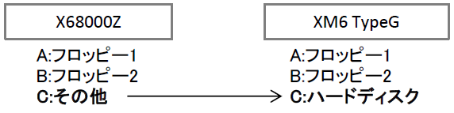
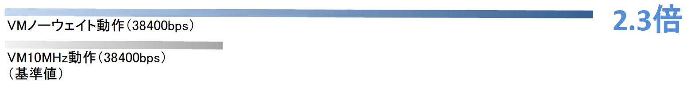

# X68000ZでUART越しにHDDディスクイメージにアクセス(2023/5/27更新)

## 概要
X68000ZからUART越しにXM6 TypeGで認識されているドライブにアクセスする方法になります。  
これにより、X68000ZからXM6 TypeG経由でHDDディスクイメージやWindowsドライブにアクセスできるようになります。  
なお、X68000実機やXM6 TypeG以外のエミュレータとの接続については未確認です。  

## 準備
X68000ZとWindows PCを下記のように接続をします。  

Windows PCにはXM6 TypeGをインストールしRS-232C設定をUSBシリアルアダプタのCOMポートに設定し通信できる状態にします。あとは、SCSIハードディスクなど必要に応じてディスクドライブを構成してください。  
X68000ZとXM6 TypeG共にHuman68k 3.02で動作確認をしています。  

## 設定方法
[hounds for RS-232C](https://www.vector.co.jp/soft/x68/net/se014252.html)（フリーソフト）を利用しますが、そのままではX68000Zで動作しません。  
そこで、X68000Zで動作するように独自に対策パッチを施してみました。  

下記、SHARPより無償公開されたHUMAN302.XDFを元に組み込んだ形で起動ディスクイメージを用意しましたので、こちらをダウンロードしてください。

[hounds_client_zpatch2.xdf](./X68000Z/hounds_client_zpatch2.xdf)（クライアント用）  
[hounds_server_zpatch2.xdf](./X68000Z/hounds_server_zpatch2.xdf)（サーバー用）  

X68000Zをクライアント用のディスクイメージで起動し、XM6 TypeGをサーバー用のディスクイメージで起動することにより、X68000ZのCドライブとしてXM6 TypeGのCドライブにアクセスできるようになります。  
  
※アクセスできない場合は、X68000Z再起動とXM6 TypeGを一旦終了して再度お試しください。

自分で組み込む場合は、ディスクイメージのHOUNDSZディレクトリに入っている HOUNDSZ.SYS が HOUNDS.SYS のパッチ版、 HOUNDSDZ.X が HOUNDSD.X のパッチ版になりますので、それぞれ読み替えてHND04BRS.LZHに含まれるINSTALL.DOCの設定手順を参照して設定してください。  
ただし、クライアント側については TMSIO.x は組み込まず、HUMAN302.XDF付属の RSDRV.SYS を組み込んでください。  
また、クライアント側をX68000Z、サーバー側をXM6 TypeGとして設定してください。（逆は不可）

## 設定例（サーバー側）
XM6 TypeG側のCONFIG.SYSに下記を追記します。  
~~~
PROCESS = 16 2 100
~~~
XM6 TypeG側のAUTOEXEC.BATに下記を追記します。  
~~~
A:\HOUNDSZ\tmsio -b128
A:\HOUNDSZ\TwentyOne +TPS
A:\HOUNDSZ\HOUNDSDZ -D0
~~~

## 設定例（クライアント側）
例）X68000ZからCドライブとしてXM6 TypeGのAドライブにアクセス  
  
X68000Z側のCONFIG.SYSに下記を追記します。
~~~
DEVICE = \SYS\RSDRV.SYS
DEVICE = \HOUNDSZ\HOUNDSZ.SYS -D0 server:A
~~~
X68000Z側のAUTOEXEC.BATに下記を追記します。  
~~~
A:\HOUNDSZ\TwentyOne +TPS
~~~

X68000Z側からCドライブとしてXM6 TypeGのAドライブ（HDD）にアクセスできます。  

## Windowsドライブにアクセスする
XM6 TypeGにWindrvXMの設定をすることでWindowsドライブにもアクセスできるようになります。  
ただし、Windowsドライブのアクセスについてはdirなど一部正常に動作しない問題を確認しています。

例）X68000ZからCドライブ、DドライブとしてXM6 TypeGのAドライブ（HDD）とDドライブ（Windowsドライブ）にアクセス  
X68000Z側のCONFIG.SYSを下記のように設定します。
~~~
DEVECE = \HOUNDSZ\HOUNDSZ.SYS -D0 server:AD
~~~

X68000Z側からDドライブとしてXM6 TypeGのDドライブ（Windowsドライブ）にアクセスできます。  

## 高速化設定

XM6 TypeGのMPUクロック設定を上げたり、VMノーウェイト動作に設定することで、アクセス速度が向上することを確認しています。  
（XM6 TypeGの[ツール]->[オプション]の[システム]タブ）  
ただし、設定により不安定になる場合がありますのでご注意ください。  
サーバー側マシンのスペックによりますが、第8世代Core i5/3.0Ghzマシンでは BASIC.X の起動時間が約2.3倍高速化しました。
  

## パッチの内容
パッチでは、RTS/CTSフロー制御OFF対応と通信速度の変更をしています。  
RTS/CTSフロー制御はX68000Zが対応していませんのでその対策になります。  
通信速度はクライアント側を RSDRV.SYS で動作するように変更した上で 38400bps に変更しています。（サーバー側は TMSIO.x を利用します。）  

下記手順で解析、リビルドしてパッチを作成しています。
1. DIS.Xで逆アセンブル
1. 解析、変更
1. HAS.Xでアセンブル
1. LK.Xでリンク、実行ファイル作成

## 注意事項
このパッチはX68000ZやXM6 TypeGで正常に動作することを保証するものではありません。本手順やプログラムに関連して発生したファイルの破損などいかなる損害も補償しません。  
本手順やプログラムはユーザーの責任において十分に確認した上で使用してください。  

## 謝辞
パッチの作成には下記のソフトウェアを使用しました。  
開発した方々に感謝です・・・。  

* hounds for RS-232C … Ext氏
* dis.x（Tachibana Eriko 版） … K.Abe氏、R.ShimiZu氏、立花えり子氏
* HAS.X … Y.Nakamura氏
* LK.X … SHARP/HUDSON

## リリースノート

### 2023/5/27

パッチをアップデートしました。  
\- RSDRV.SYS対応、38400bps化

### 2023/5/13

初版
