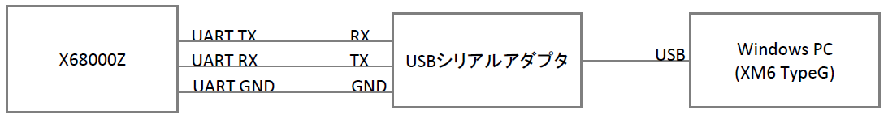
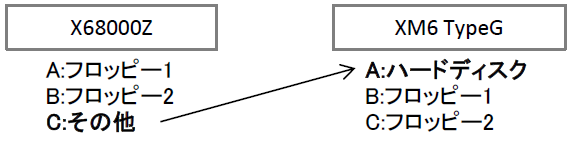
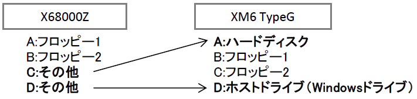

# X68000ZでUART越しにHDDディスクイメージにアクセスする方法

## 概要
X68000ZからUART越しにXM6 TypeGで認識されているドライブにアクセスする方法になります。  
これにより、X68000ZからXM6 TypeG経由でHDDディスクイメージやWindowsドライブにアクセスできるようになります。  
なお、X68000実機との接続については未確認です。  

## 準備
X68000ZとWindows PCを下記のように接続をします。  

Windows PCにはXM6 TypeGをインストールしRS-232C設定をUSBシリアルアダプタのCOMポートに設定し通信できる状態にします。あとは、SCSIハードディスクなど必要に応じてディスクドライブを構成してください。  
X68000ZとXM6 TypeG共にHuman68k 3.02で動作確認をしています。  

## 設定
hounds for RS-232C（フリーソフト）を利用します。  
[https://www.vector.co.jp/soft/x68/net/se014252.html](https://www.vector.co.jp/soft/x68/net/se014252.html)  
ただし、そのままではX68000Zで動作しませんので、独自に対策を施した下記パッチを当ててください。  

[HOUNDS_Z.bfd](./X68000Z/HOUNDS_Z.bfd)（私が独自に作成したパッチになります）

使い方は、HND04BRS.LZHを解凍してHOUNDS.SYSとHOUNDSD.XがあるディレクトリへHOUNDS_Z.BFDをコピーして、  
~~~
> BUP HOUNDS_Z.BFD
~~~
として差分を適用してください。同じディレクトリにHOUNDSZ.SYSとHOUNDSDZ.Xというファイルが作られます。  

作成したHOUNDSZ.SYSはHOUNDS.SYSのZ対応版、HOUNDSDZ.XはHOUNDSD.XのZ対応版になります。それぞれ読み替えてHND04BRS.LZHに含まれるINSTALL.DOCの設定手順の通りに設定してください。（デフォルトでデバッグ表示されるためサーバー、クライアント共に-D0オプションの指定をお勧めします）  

X68000Z側をクライアント、XM6 TypeG側をサーバー側に設定することで、X68000ZからXM6 TypeGのドライブにアクセスできるようになります。（逆も可）  

## 設定例
例）X68000ZからCドライブとしてXM6 TypeGのHDDドライブにアクセス  
X68000ZのCONFIG.SYS設定
~~~
DEVECE=HOUNDSZ.SYS -D0 server:A
~~~

X68000Z側からCドライブとしてXM6 TypeGのAドライブ（HDD）にアクセスできます。  

## Windowsドライブにアクセスする
XM6 TypeGにWindrvXMの設定をすることでWindowsドライブにもアクセスできるようになります。  
ただし、Windowsドライブのアクセスについてはdirなど一部正常に動作しない問題を確認しています。

例）X68000ZからC、DドライブとしてXM6 TypeGのHDDドライブとWindowsドライブにアクセス  
X68000ZのCONFIG.SYS設定
~~~
DEVECE=HOUNDSZ.SYS -D0 server:AD
~~~

X68000Z側からDドライブとしてXM6 TypeGのDドライブ（Windowsドライブ）にアクセスできます。  

## HOUNDS_Z.bfdパッチ内容
パッチでは、RTS/CTSフロー制御OFF対応と通信速度の変更をしています。  
RTS/CTSフロー制御はX68000Zが対応していませんのでその対策になります。  
通信速度はそのままでは安定しませんでしたので9600bpsに落としています。  

下記手順で解析、リビルドしてパッチを作成しています。
1. DIS.Xで逆アセンブル
1. 解析、変更
1. HAS.Xでアセンブル
1. LK.Xでリンク、実行ファイル作成
1. BDIF.Xで差分ファイル作成

## 注意事項
このパッチはX68000ZやXM6 TypeGで正常に動作することを保証するものではありません。本手順やプログラムに関連して発生したファイルの破損などいかなる損害も補償しません。  
本手順やプログラムはユーザーの責任において十分に確認した上で使用してください。  

## 謝辞
パッチの作成には下記のソフトウェアを使用しました。  
開発した方々に感謝です・・・。  

* hounds for RS-232C … Ext氏
* dis.x（Tachibana Eriko 版） … K.Abe氏、R.ShimiZu氏、立花えり子氏
* HAS.X … Y.Nakamura氏
* LK.X … SHARP/HUDSON
* BdifSet … 東出浩一氏
