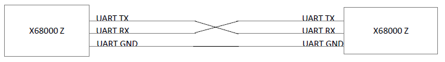
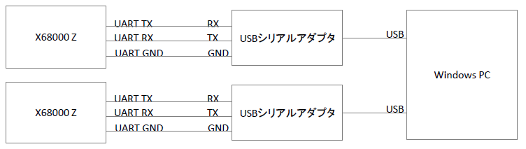
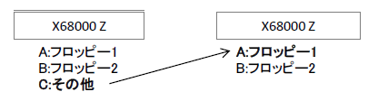
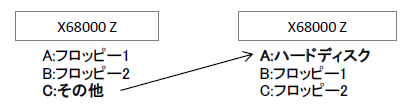

# 2台のX68000Zを繋いでUART越しにディスクアクセス

## 概要
2台のX68000ZをUARTで繋いで、X68000Zからもう一台のX68000Zのドライブにアクセスする方法になります。  

## 準備
2台のX68000ZをUARTで繋ぐ方法として下記2パターンで動作確認しました。  

①UARTケーブル2本を直結して繋ぐ方法  
下記のようにUARTケーブル2本を結線して2台のX68000Zを接続します。  
  

②2台のX68000ZをUSBシリアルアダプタでPCに接続してブリッジプログラムで繋ぐ方法  
下記のようにUSBシリアルアダプタで2台のX68000ZをPCに接続します。  
  
下記のブリッジプログラムで2つのシリアルポート同士の送受信ができます。  
[https://github.com/nissy24n/serial_bridge](https://github.com/nissy24n/serial_bridge)  

## 設定方法
[hounds for RS-232C](https://www.vector.co.jp/soft/x68/net/se014252.html)（フリーソフト）を利用しますが、そのままではX68000Zで動作しません。  
そこで、X68000Zで動作するように独自に対策パッチを施してみました。  

下記、SHARPより無償公開されたHUMAN302.XDFを元に組み込んだ形で起動ディスクイメージを用意しましたので、こちらをダウンロードしてください。

[hounds_client_zpatch2.5.xdf](./X68000Z/hounds_client_zpatch2.5.xdf)（クライアント用）  
[hounds_server_zpatch2.5.xdf](./X68000Z/hounds_server_zpatch2.5.xdf)（サーバー用）  

一台のX68000Zをクライアント用のディスクイメージで起動し、もう一台をサーバー用のディスクイメージで起動することにより、クライアント側X68000ZのCドライブとしてサーバー側X68000ZのAドライブにアクセスできるようになります。  
  

自分で組み込む場合は、ディスクイメージのHOUNDSZディレクトリに入っている HOUNDSZ.SYS が HOUNDS.SYS のパッチ版、 HOUNDSDZ.X が HOUNDSD.X のパッチ版になりますので、それぞれ読み替えてHND04BRS.LZHに含まれるINSTALL.DOCの設定手順を参照して設定してください。  
ただし、TMSIO.x は組み込まず、HUMAN302.XDF付属の RSDRV.SYS を組み込んでください。  

## 設定例（サーバー側）
CONFIG.SYSに下記を追記します。  
~~~
PROCESS = 16 2 100
DEVICE = \SYS\RSDRV.SYS
~~~
AUTOEXEC.BATに下記を追記します。  
~~~
A:\HOUNDSZ\TwentyOne +TPS
A:\HOUNDSZ\HOUNDSDZ -D0
~~~

## 設定例（クライアント側）
例）Cドライブとしてサーバー側X68000ZのAドライブにアクセス  
  
CONFIG.SYSに下記を追記します。
~~~
DEVICE = \SYS\RSDRV.SYS
DEVICE = \HOUNDSZ\HOUNDSZ.SYS -D0 server:A
~~~
AUTOEXEC.BATに下記を追記します。  
~~~
A:\HOUNDSZ\TwentyOne +TPS
~~~

クライアント側X68000ZからCドライブとしてサーバー側X68000ZのAドライブ（ハードディスク）にアクセスできます。  

## パッチの内容
パッチでは、RTS/CTSフロー制御OFF対応と通信速度の変更をしています。  
RTS/CTSフロー制御はX68000Zが対応していませんのでその対策になります。  
通信速度は RSDRV.SYS で動作するように変更した上で 38400bps に変更しています。  

下記手順で解析、リビルドしてパッチを作成しています。
1. DIS.Xで逆アセンブル
1. 解析、変更
1. HAS.Xでアセンブル
1. LK.Xでリンク、実行ファイル作成

## 注意事項
このパッチはX68000Zで正常に動作することを保証するものではありません。本手順やプログラムに関連して発生したファイルの破損などいかなる損害も補償しません。  
本手順やプログラムはユーザーの責任において十分に確認した上で使用してください。  

## 謝辞
パッチの作成には下記のソフトウェアを使用しました。  
開発した方々に感謝です・・・。  

* hounds for RS-232C … Ext氏
* dis.x（Tachibana Eriko 版） … K.Abe氏、R.ShimiZu氏、立花えり子氏
* HAS.X … Y.Nakamura氏
* LK.X … SHARP/HUDSON

## リリースノート

### 2023/12/15

初版
