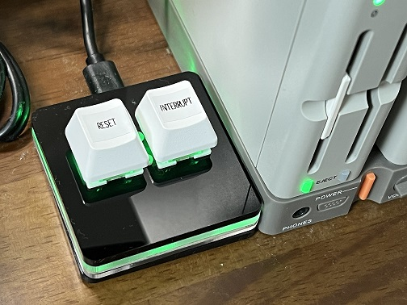
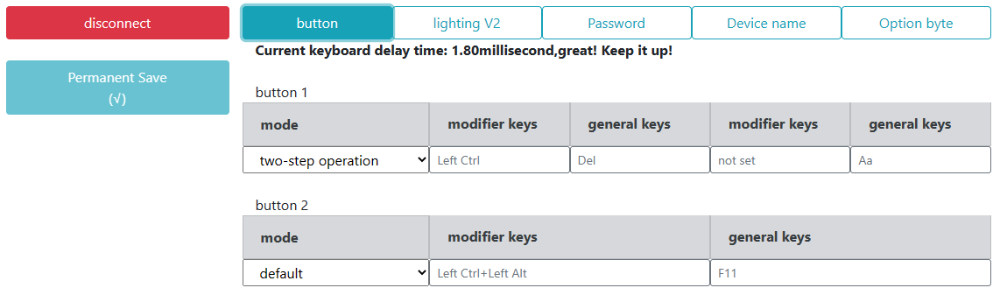

# X68000Zにソフトウェアリセットボタンを追加

## 概要
X68000Zのリセットボタンは本体自体がリセットされるボタンになっています。そのため、SDカードの書き込みが行われずに更新内容が失われたり、ゲームランチャーまで戻ったりしてしまいます。  
そこで、エミュレータ内で再起動するソフトウェアリセットボタンをプログラマブルキーボードを使って設定してみましたので、その設定例をご紹介します。  
  

## 準備
下記の2キープログラマブルキーボードを利用してみました。  
[OSUキーパッド 2キープログラマブルキーボード USBキーボード、 diy片手ホットキースイッチキーボード、マクロおよびリズムゲーム用のミニメカニカルキーボードRGBキーパッド。](https://www.amazon.co.jp/gp/product/B09WNJY68N/)  
このプログラマブルキーボードにRESETボタンとINTERRUPTボタンを設定をします。

RESETについては、標準のショートカットCTRL+OPT.1+DELと同等に動作するように設定します。  
（付属の「グラディウス」や「超連射68K」の起動でもRESETがかけられます。）  

INTERRUPTについては、ショートカットがないのでKeyWitch.Xを使う前提で設定します。  

## 設定方法
RESETボタンについては、CTRL+OPT.1+DELのショートカットを設定するのですが、今回使用したプログラマブルキーボードでは1キーでCTRL+OPT.1+DELの組み合わせが実現できませんでした・・・。  
色々試してみた結果、CTRL+OPT.1とCTRL+DELというように2つのキーに設定した上で、2キーを組み合わせてリセットできることが分かりましたので、その様な設定にします。  
INTERRUPTについては、ショートカットがないので KeyWitch.X を使う前提でキー設定をします。  

左側のボタンがbutton1、右側のボタンがbutton2になります。

今回の設定では、下記のような動作になります。  
・buttton2+button1でRESET（CTRL+OPT.1+DEL）  
・buttton2単独で押したときはINTERRUPT（KeyWitch.x利用時のみ有効）  
・INTERRUPT後、button1で無視\<A\>する。

下記、プログラマブルキーボード設定ツールの設定画面です。  
  

button1の設定：  
CTRL+DELを押すように設定します。button2と組み合わせることでCTRL+OPT.1+DELになります。  
ただし、button2がINTERRUPTとして動作した場合に入力待ちになりRESETできないので2ステップ入力で、CTRL+DELを押した後にAを押す設定にしています。この2ステップ入力のAでINTERRUPTが無視\<A\>されてRESETされます。  
（INTERRUPTを設定しない場合でも、RESET後にAが押されるだけなので問題ないかと思います。）  

button2の設定：  
CTRL+XF1+OPT.1を押すように設定します。WindowsキーボードなのでXF1はLeft Alt、OPT.1はF11になります。  
XF1はRESETするときには不要ですが、CTRL+XF1でINTERRUPTの設定ができるようにXF1も設定しておきます。

ここまでの設定で、特に何も組み込まなくてもbutton2+bottun1でRESETできるようになります。

## INTERRUPTの設定
INTERRUPTのキー設定は KeyWitch.X を組み込むことで実現します。  
上記の設定と組み合わせて、button2単独で押したとき（CTRL+XF1）でINTERRUPTを発生さます。  

__KeyWitch.Xの設定__  
環境定義ファイル INTERRUPT.ENV を下記の内容で作成します。  
~~~
% KeyWitch 環境定義ファイル
%
% ファイル名: interrupt.env
%       内容: CTRL+XF1 で、INTERRUPTします。

&name 55 XF1
&name 89 CTRL

&int CTRL=1 XF1=1
~~~

AUTOEXEC.BATで下記のように組み込みます。
~~~
A:\KEYWITCH INTERRUPT.ENV
~~~

上記設定を組み込んだ状態で、button2でINTERRUPTが発生するようになります。  

## その他
[KeyWitch.X](http://retropc.net/x68000/software/system/key/keywitch/)は[X68000 LIBRARY](http://retropc.net/x68000/)からダウンロードできます。  

## リリースノート

### 2023/6/3

初版
